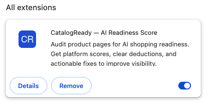
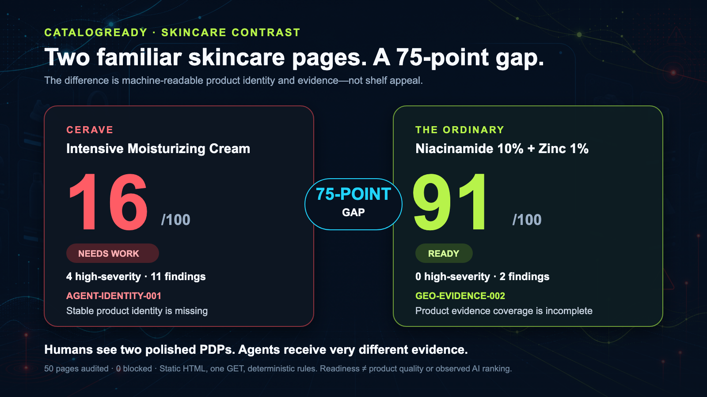

# CatalogReady

**Can AI shopping agents actually read your product page?**

CatalogReady is the open-source Lighthouse for AI shopping. Point it at a
product page and get a transparent 0–100 readiness score, the exact product
data machines can and cannot read, unsupported marketing claims, and
paste-ready fixes.

**Offline · deterministic rules · no API key · never writes to your store.**

## Install the Chrome extension

**CatalogReady — AI Readiness Score is now available in the Chrome Web
Store.** Audit any product page in one click, compare platform-specific
readiness scores, inspect every deduction, and get actionable fixes.

[**Add CatalogReady to Chrome →**](https://chromewebstore.google.com/detail/hakmmfmdiaalfnbcipmanhjlblbdhnem?utm_source=item-share-cb)

[](https://chromewebstore.google.com/detail/hakmmfmdiaalfnbcipmanhjlblbdhnem?utm_source=item-share-cb)

## The benchmark result

> **40 of 50 real product pages (80%) were not ready for AI shopping
> agents — even though every page was reachable and auditable.**

The benchmark covers 50 different domains across fashion, electronics,
home, beauty, and grocery. It uses one GET per page and the same
deterministic audit as the CLI: no model, no synthetic data, and no points
for generated fixes. [See every score and the methodology →](benchmark/BENCHMARK.md)

**Benchmark earns trust. The case makes it memorable. The scorecard makes
it shareable.**

**A real skincare contrast:**
[CeraVe Intensive Moisturizing Cream](https://www.cerave.com/skincare/moisturizers/intensive-moisturizing-cream)
scored **16/100** with 4 high-severity findings. Another mainstream skincare
page —
[The Ordinary Niacinamide 10% + Zinc 1%](https://theordinary.com/en-us/niacinamide-10-zinc-1-serum-100436.html)
— scored **91/100** with no high-severity findings: a **75-point gap**
in machine-readable product identity and evidence.

[](benchmark/BENCHMARK.md)

Reproduce the full 50-page benchmark:

```bash
uv run python scripts/benchmark.py benchmark/urls.txt benchmark/BENCHMARK.md
```

*The benchmark measures fetched static HTML, not product quality,
popularity, or observed ranking in an AI answer.*

## See it in action

Audit a live product page from the CatalogReady browser extension, compare the
platform-specific readiness scores, inspect every deduction, and generate
evidence-backed fixes without writing to the storefront.


```bash
uvx --from catalogready-ai catalogready https://your-store.com/products/example
```

```text
  Waterproof Commuter Shoe – Blue

  CatalogReady Score: 82/100 (ready)

  Product identity      16/20
  Offer completeness    20/20
  Structured data       20/20
  Decision evidence     14/15
  Media & variants       2/15
  Claim grounding       10/10

  0 critical · 2 recommended · 0 minor findings
  Full report: catalogready-report.html
```

The HTML report is a single self-contained file: score dial, per-pillar
breakdown, every finding with a stable rule ID, the questions only the
merchant can answer, a recommended Product JSON-LD block built strictly
from evidence found on the page, and a downloadable PNG score card.

## Why this exists

ChatGPT shopping, Google AI results, and Perplexity buy-flows read product
pages with machines, not eyes. A page can look perfect to humans while
being invisible or untrustworthy to an AI shopping agent: missing stable
IDs, incomplete offers, absent Product JSON-LD, and marketing claims with
no supporting evidence.

CatalogReady checks what the machines check — deterministically, locally,
and with a score that survives scrutiny:

- **Only your page earns points.** Nothing CatalogReady generates
  contributes to the score.
- **Blocking defects cap the score.** Duplicate IDs, incomplete offers,
  missing structured data, or an unsupported high-risk claim hard-cap the
  number, no matter how complete everything else is.
- **Every finding cites evidence** and carries a rule ID you can grep for.
  [docs/RULES.md](docs/RULES.md) documents every rule with its source —
  Google's merchant-listing requirements, OpenAI's Agentic Commerce feed
  spec, Bing's Copilot grounding guidelines, and the published crawler
  documentation of OpenAI, Perplexity, and Anthropic.

See [docs/scoring-methodology.md](docs/scoring-methodology.md) for the full
rubric and caps.

## Quick start with ChatGPT, Claude, Gemini, or DeepSeek

Use CatalogReady with the chat app you already have open — **no plugin,
no account linking, no API key**. The tool computes the real score; your
chatbot explains it and plans the fixes.

**Step 1 — install `uv` (once, skip if you have it):**

```bash
# macOS / Linux
curl -LsSf https://astral.sh/uv/install.sh | sh
```

```powershell
# Windows (PowerShell)
powershell -ExecutionPolicy ByPass -c "irm https://astral.sh/uv/install.ps1 | iex"
```

**Step 2 — audit your product page (one command, replace the URL):**

```bash
uvx --from catalogready-ai catalogready audit https://your-store.com/products/example --json > audit.json
```

This writes `audit.json` (the full result) and `catalogready-report.html`
(a visual report you can open in a browser).

**Step 3 — open your chatbox:**
[chatgpt.com](https://chatgpt.com) · [claude.ai](https://claude.ai) ·
[gemini.google.com](https://gemini.google.com) ·
[chat.deepseek.com](https://chat.deepseek.com)

**Step 4 — copy this prompt into the chat:**

```text
I ran CatalogReady (github.com/PO-VINCENT/ai-shopping-audit), an
open-source auditor that scores product pages 0–100 for AI-shopping
readiness using deterministic rules. Below is the JSON result for my
product page. Act as my e-commerce consultant:
1. Explain the score, the pillar breakdown, and any caps in plain language.
2. Prioritize the findings into a fix list, most damaging first.
3. Show me the corrected Product JSON-LD using ONLY facts present in
   this JSON — do not invent product data.
4. Tell me which merchant questions I must answer and why they matter.
Here is the audit JSON:
```

**Step 5 — paste the contents of `audit.json` right below the prompt and
send.** (Or attach `audit.json` as a file — ChatGPT, Claude, and Gemini
all accept file uploads.)

**Step 6 — keep the conversation going.** Good follow-ups:
*"Rewrite my product title following the fix list"* ·
*"Explain rule GEO-PRODUCT-003"* ·
*"I fixed the JSON-LD — what should I verify after deploying?"*
(Re-run Step 2 after each fix to watch the score climb.)

### Prefer your assistant to run the audit itself? (MCP)

Agentic assistants can call CatalogReady as a tool via its MCP server.
Then just ask: *"Fetch https://store.example/products/x and run the
CatalogReady agent on the HTML — summarize the score and the top fixes."*
A matching [Agent Skill](skills/catalogready/SKILL.md) teaches Claude
Code, Codex CLI, and any other [agentskills.io](https://agentskills.io)
adopter when to reach for the tools and which guardrails apply — install
snippets in
[QUICKSTART-AI-ASSISTANTS.md](docs/QUICKSTART-AI-ASSISTANTS.md).

**Claude Code** — one line:

```bash
claude mcp add catalogready -- uvx --from catalogready-ai catalogready-mcp
```

<details>
<summary><strong>ChatGPT / Codex CLI</strong></summary>

Add to `~/.codex/config.toml` (or a trusted project's `.codex/config.toml`):

```toml
[mcp_servers.catalogready]
command = "uvx"
args = ["--from", "catalogready-ai", "catalogready-mcp"]
startup_timeout_sec = 20
tool_timeout_sec = 120
```

ChatGPT's web/desktop connectors expect remote MCP servers; for a local
audit tool, Codex CLI is the supported path today.
</details>

<details>
<summary><strong>Claude Desktop</strong></summary>

Add to `claude_desktop_config.json` → `mcpServers`:

```json
{
  "mcpServers": {
    "catalogready": {
      "command": "uvx",
      "args": ["--from", "catalogready-ai", "catalogready-mcp"]
    }
  }
}
```
</details>

<details>
<summary><strong>Gemini CLI</strong></summary>

Add to `.gemini/settings.json` (this repo ships one):

```json
{
  "mcpServers": {
    "catalogready": {
      "command": "uvx",
      "args": ["--from", "catalogready-ai", "catalogready-mcp"],
      "trust": false
    }
  }
}
```

Gemini Enterprise can use the A2A agent card instead — see
[docs/INTEROPERABILITY.md](docs/INTEROPERABILITY.md).
</details>

<details>
<summary><strong>DeepSeek</strong> (as the model inside CatalogReady)</summary>

DeepSeek has no MCP client, so the integration runs the other way: use
DeepSeek as the optional model powering CatalogReady's chat answers and
listing drafts:

```bash
# .env next to where you run the server
DEEPSEEK_API_KEY=…
DEEPSEEK_MODEL=deepseek-chat
```

Then pick **DeepSeek** in the dashboard/extension, or `--provider deepseek`.
The same pattern works for OpenAI, Gemini, and Claude keys — see
[docs/BYO-KEYS.md](docs/BYO-KEYS.md).
</details>

The full guide — including **Copilot** (VS Code agent mode) and each
vendor as the BYO model inside CatalogReady — is
[docs/QUICKSTART-AI-ASSISTANTS.md](docs/QUICKSTART-AI-ASSISTANTS.md).

## Install and run

```bash
# one-off (recommended for a first try)
uvx --from catalogready-ai catalogready https://your-store.com/products/example

# or as a checkout
uv sync
uv run catalogready audit https://your-store.com/products/example

# fully offline: audit a saved page instead of fetching it
uv run catalogready audit https://your-store.com/products/example saved-page.html

# machine-readable output
uv run catalogready audit <url> [saved.html] --json

# also fetch product images to check marketplace size minimums (max 3 requests)
uv run catalogready audit <url> --online
```

Fetching is exactly one HTTP GET for the page you name. The audit engine
itself makes no network calls — the test suite runs with networking
disabled.

Try it on the bundled examples without touching the network:

```bash
uv run catalogready audit https://example.com/products/cr-001 examples/demo-store/index.html
uv run catalogready catalog examples/messy-apparel.csv   # scores 51/100, and shows exactly why
```

## What gets checked

| Pillar | Examples of rules |
|---|---|
| Product identity | stable ID (SKU/GTIN/MPN), brand, category, canonical URL |
| Offer completeness | price + currency + availability, complete Offer markup |
| Structured data | Product JSON-LD present, valid, consistent with the visible page |
| Decision evidence | description, specifications, shipping/returns/care/limitations on the page |
| Media & variants | primary image, image count, variant attributes and identity |
| Claim grounding | superlatives, “clinically proven”, warranty and performance claims checked against page evidence |

When facts are missing, CatalogReady asks instead of inventing: the report
lists the questions only the merchant can answer, and
`--answers merchant-answers.json` resumes the audit with verified values.

## Interactive agent session

`catalogready chat` opens a Claude Code-style terminal session over the
bounded agent — audit, ask, answer, fix:

```text
catalogready> /audit https://your-store.com/products/example
● inspect_product_page — Extracted 3 evidence items ...
● audit_product — Measured readiness at 1/100 and produced 14 findings.

  CatalogReady Score: 1/100 (needs_work)
  ...
  [blocking] price: What is the current verified product price?

catalogready> why is offer completeness low?
Offer completeness: 0/20
  ✗ price
  ✗ currency
  ...

catalogready> /answers sku=CR-100 price=49.00 currency=AUD availability=in_stock
catalogready> /draft
Isolated preview validation: 1 → 29 (+28), status validated.

catalogready> /report
```

The agent pauses for facts it cannot verify instead of inventing them;
`/answers` resumes it. Free-text questions are answered deterministically
from the audit result; set `/provider openai` (or `gemini`, `claude`,
`deepseek` — keys via server environment variables only) for open-ended,
model-answered questions grounded strictly in the audit JSON.

## Interactive dashboard

One command serves the web UI and the local API on the same port and opens
your browser:

```bash
uvx --from catalogready-ai catalogready dashboard   # or: uv run catalogready dashboard
```

Enter a product URL and press Audit — the local server fetches the page
for you (one request). Or paste the HTML / load the built-in good/bad demos
to stay fully offline.
Every audit produces a plain-language summary conclusion, auto-drafted fix
suggestions with an isolated preview validation, expandable per-pillar score
explanations, inline merchant questions, a paste-ready JSON-LD patch, an
"Ask the agent" chat window, and a downloadable HTML report. The UI follows
your browser language (English / 中文, switchable in the header). Everything
runs locally; the page never asks for API keys.

**Why the extension and the URL fetch can score differently:** the
extension audits the *rendered* page (what a browsing agent sees); the
URL fetch audits the *static* HTML (what non-rendering crawlers like
OAI-SearchBot and PerplexityBot receive). Both views are labeled in the
UI, and the gap between them measures your page's JavaScript dependence —
content that only exists after rendering is invisible to most AI
crawlers, which is why Google recommends putting Product data in the
initial HTML.

## How it compares

**CatalogReady measures whether your product page is _citable_ by an AI
shopping agent — an input you control — not whether it happened to be _cited_,
an outcome that changes on every run.** That axis is what separates it from
each neighbouring category:

| Axis | CatalogReady | Schema validators | GEO/AEO visibility | Feed & PIM tools | AI copy generators | SEO suites |
|---|---|---|---|---|---|---|
| Open source, self-hostable, no account/key | ✓ | some | ✗ | ✗ | ✗ | ✗ |
| Deterministic — every point traces to a cited rule | ✓ | n/a (syntax) | ✗ (probabilistic) | ✗ | ✗ | ✗ (opaque) |
| Audits the live page an AI agent fetches & renders | ✓ | ✓ (syntax only) | ✗ (asks the LLM) | ✗ (the feed, not the page) | ✗ | partial |
| Scores product completeness for AI shopping agents | ✓ | ✗ | ✗ | partial (feed-side) | ✗ | ✗ |
| Checks marketing claims against on-page evidence | ✓ | ✗ | ✗ | ✗ | ✗ (generates them) | ✗ |
| Scores checkout transactability (UCP/ACP era) | ✓ | ✗ | ✗ | ✗ | ✗ | ✗ |
| Paste-ready JSON-LD fix, built only from page evidence | ✓ | ✗ | ✗ | ✗ | generated, ungrounded | ✗ |

Representative tools per column — **Schema validators:** Google Rich Results
Test, `google/schemarama`, `spatie/schema-org`; **GEO/AEO visibility:**
Profound, Peec.ai, Otterly, Adobe LLM Optimizer; **Feed & PIM:** Feedonomics,
DataFeedWatch, Salsify, Akeneo; **AI copy generators:** Describely, Hypotenuse,
Jasper; **SEO suites:** Screaming Frog, Semrush, Ahrefs.

No tool combines all seven rows: schema validators own row 3 only; GEO/AEO
platforms measure the *outcome* this score is the *input* for; feed & PIM tools
work the feed instead of the public page; generators create the very claims
CatalogReady audits. The transactability row has no competition yet — the
protocols it checks against (UCP, ACP checkout) are only months old.

## Bring your own model key (optional)

Everything above runs with **no key**. To enable model-assisted planning,
chat answers, and listing drafts, put a provider key in the server's
`.env` — see [docs/BYO-KEYS.md](docs/BYO-KEYS.md). Keys never enter the
dashboard, the extension, or tool arguments.

## Also in the box

The audit engine is a vendor-neutral service with several thin surfaces.
These are secondary to the page audit and documented in
[docs/ROADMAP.md](docs/ROADMAP.md):

- `catalogready catalog feed.csv` — CSV catalog audit with the same
  deduction-and-cap scoring.
- `catalogready-api` — HTTP server with OpenAPI docs and an A2A agent card.
- A Chromium extension (`browser-extension-standalone/`, on the
  [Chrome Web Store](https://chromewebstore.google.com/detail/hakmmfmdiaalfnbcipmanhjlblbdhnem))
  — one click on any product page runs the deterministic audit fully
  in-browser: score, per-platform views, findings, merchant questions,
  and a rendered-vs-crawler comparison. No server needed; an optional
  local server adds AI fix drafts. Works on bot-protected storefronts
  because it reads what your browser rendered.
- An [Agent Skill](skills/catalogready/SKILL.md) (`skills/catalogready/`)
  auto-discovered by Claude Code and Codex CLI inside this repo, and
  installable globally — see
  [docs/QUICKSTART-AI-ASSISTANTS.md](docs/QUICKSTART-AI-ASSISTANTS.md).
- Optional model-assisted listing drafts (OpenAI, Gemini, Claude, DeepSeek)
  with bring-your-own keys via server environment variables — never in tool
  arguments or browser storage — and deterministic claim evaluation with
  publishing safety caps.

## Guarantees

- The deterministic core requires no API key and makes no network calls.
- CatalogReady never writes to a storefront, feed, or merchant system.
- It never invents product attributes, citations, or rankings.
- A readiness score is not a promise of ranking or citation by any AI
  system — and any tool that promises that is guessing.

## Contributing

Rule proposals are the most valuable contribution — see
[CONTRIBUTING.md](CONTRIBUTING.md) and the issue templates. Run the suite
with `python -m unittest discover -s tests -v`; it must pass offline.

Architecture and module design: [docs/repository-design.md](docs/repository-design.md) ·
Rules with sources: [docs/RULES.md](docs/RULES.md) ·
Metrics & landscape: [docs/METRICS.md](docs/METRICS.md) ·
Scoring: [docs/scoring-methodology.md](docs/scoring-methodology.md) ·
Interoperability: [docs/INTEROPERABILITY.md](docs/INTEROPERABILITY.md) ·
Roadmap: [docs/ROADMAP.md](docs/ROADMAP.md) ·
Browser extension privacy: [docs/PRIVACY.md](docs/PRIVACY.md)

## Contact

Built by **Vincent Po Li**. Questions, fix help, partnership, or feedback:

- Issues / discussions: [github.com/PO-VINCENT/ai-shopping-audit](https://github.com/PO-VINCENT/ai-shopping-audit/issues)
- Email: [vincentli802@hotmail.com](mailto:vincentli802@hotmail.com)
- LinkedIn: [vincent-po-li](https://www.linkedin.com/in/vincent-po-li-324291122/)
- X: [@Vincent_Po_Li](https://x.com/Vincent_Po_Li)
- 小红书 (Xiaohongshu): `vincent726217`

Licensed under [Apache-2.0](LICENSE).
