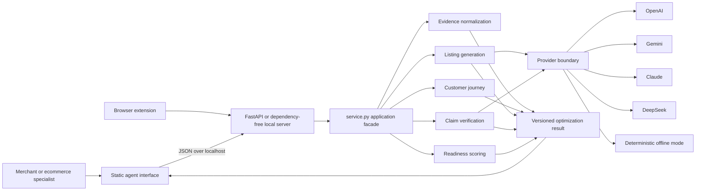
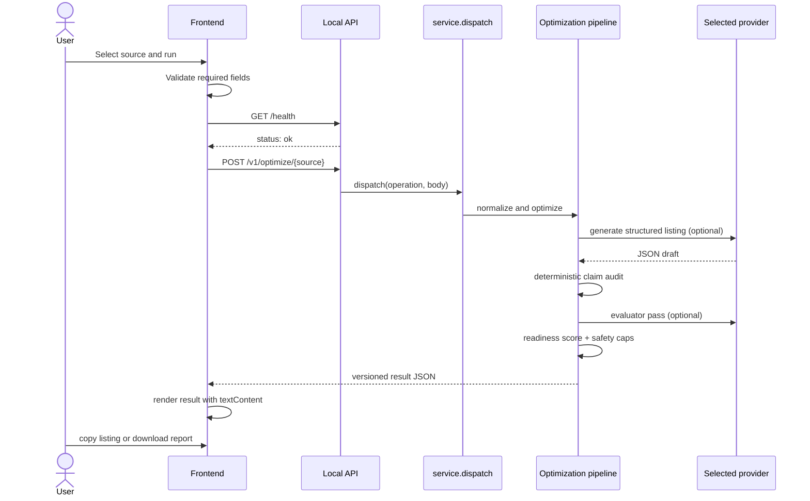
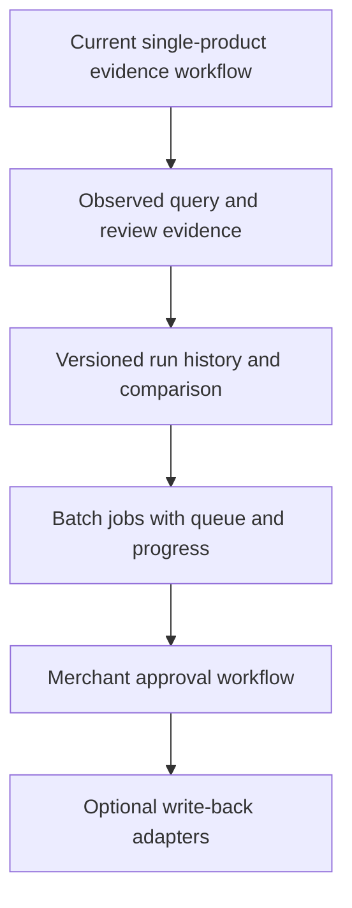

# Frontend Agent: Detailed Code and Architecture

> This document describes the standalone listing-optimization dashboard. The
> v0.4 browser extension now calls the bounded Product Readiness Agent; see
> `product-readiness-agent.md` for that contract and safety boundary.

This document describes the implemented CatalogReady product-visibility agent
interface, the backend modules it invokes, the result contract it renders, and
the extension boundaries for a production deployment.

## 1. Product boundary

The frontend is a review workspace, not a storefront editor. It accepts one
product from rendered HTML, a CSV file, or an authorized Shopify connection and
returns:

1. normalized, source-attributed product evidence;
2. target-customer hypotheses;
3. a six-stage shopping journey and associated questions;
4. an evidence-grounded listing draft;
5. a claim-by-claim audit;
6. a transparent readiness score;
7. a merchant-review gate.

The MVP deliberately does not crawl arbitrary websites, write to Shopify,
publish generated copy, infer query volume, or claim that readiness guarantees
AI citations or search rankings.

## 2. Runtime architecture



The domain code does not depend on the frontend, FastAPI, MCP, A2A, or any
provider SDK. Every adapter calls the same `dispatch()` application facade and
receives the same JSON result.

## 3. Repository modules

```text
catalogready-ai/
├── frontend/
│   ├── index.html                 # semantic UI and result regions
│   ├── styles.css                 # responsive editorial design system
│   ├── app.js                     # state, API calls, and safe rendering
│   └── README.md                  # local run instructions
├── browser-extension/
│   ├── manifest.json              # Manifest V3 permissions
│   ├── popup.html
│   ├── popup.css
│   └── popup.js                   # captures active rendered page HTML
├── src/catalogready/
│   ├── optimization/
│   │   ├── evidence.py            # HTML/CSV/Shopify normalization
│   │   ├── journey.py             # customer types and six stages
│   │   ├── prompts.py             # constrained JSON generation prompts
│   │   ├── pipeline.py            # end-to-end orchestration
│   │   ├── evaluation.py          # deterministic and model claim checks
│   │   ├── scoring.py             # weighted readiness score and caps
│   │   └── shopify.py             # read-only Admin GraphQL fetch
│   ├── model_providers/
│   │   ├── base.py                # common provider protocol and HTTP helper
│   │   └── __init__.py            # provider registry and adapters
│   ├── service.py                 # stable operation dispatch facade
│   ├── local_server.py            # localhost-only, dependency-free API
│   ├── api_server.py              # FastAPI, OpenAPI, REST, and A2A
│   ├── mcp_server.py              # Codex/Claude/Gemini MCP adapter
│   └── cli.py                     # terminal adapter
├── contracts/
│   └── product-optimization-result.schema.json
└── tests/
    ├── test_optimization.py
    ├── test_model_providers.py
    └── test_service.py
```

## 4. Frontend composition

### `frontend/index.html`

The HTML defines four interface areas without embedding business logic:

- top bar and local-agent connection state;
- settings for server URL, provider, model ID, and market;
- source composer for product HTML, CSV, and Shopify;
- result workspace with overview, journey, listing, and evidence tabs.

Important result targets include:

| Region | Element IDs | Purpose |
|---|---|---|
| Product | `result-product-title`, `result-product-meta` | normalized identity |
| Score | `readiness-score`, `score-components` | score and component weights |
| Journey | `customer-list`, `journey-timeline` | audience and stage questions |
| Listing | `draft-title`, `draft-description`, `draft-faq` | generated decision support |
| Audit | `claim-audit`, `missing-information` | grounding and evidence gaps |

### `frontend/styles.css`

The CSS implements a small token-based design system:

```css
:root {
  --paper: #f2efe7;
  --surface: #fbfaf6;
  --ink: #17201b;
  --forest: #123d2d;
  --amber: #d99436;
  --red: #a53a2d;
}
```

The visual hierarchy uses:

- warm editorial surfaces instead of a generic admin dashboard;
- a serif display face for product-analysis hierarchy;
- forest green for trusted/supported states;
- amber for review-required states;
- red only for unsupported or contradicted claims;
- a two-column desktop workspace that stacks below 1050 px;
- explicit focus styles and reduced-motion support.

### `frontend/app.js`

The JavaScript is dependency-free and has five responsibilities:

1. **Configuration** — loads and stores non-secret settings.
2. **Input management** — switches source types and reads CSV files.
3. **Transport** — checks health and posts JSON to the selected endpoint.
4. **Rendering** — maps the result contract into DOM nodes.
5. **Export** — copies the listing or downloads the complete JSON report.

The only mutable application state is:

```javascript
const state = {
  source: "html",
  csvText: "",
  result: null,
};
```

Provider keys are not part of this state and are not accepted by the UI.

## 5. Frontend execution flow



The main event handler is conceptually:

```javascript
async function runAgent() {
  const request = buildRequest();
  const available = await checkHealth();
  if (!available) throw new Error("Cannot reach the local agent");

  const response = await fetch(`${serverBase()}${request.path}`, {
    method: "POST",
    headers: {"Content-Type": "application/json"},
    body: JSON.stringify(request.body),
  });

  state.result = await readResponse(response);
  renderResult(state.result);
}
```

The implementation wraps this flow with user-facing error handling and button
loading state.

## 6. Input contracts

Every optimization input supports these common options:

```json
{
  "provider": "deterministic",
  "model": "",
  "market": "en-AU",
  "target_customer_types": [
    "problem_solver",
    "comparison_shopper"
  ]
}
```

### Product HTML

`POST /v1/optimize/html`

```json
{
  "url": "https://store.example/products/commuter-shell",
  "html": "<html>...</html>",
  "provider": "deterministic",
  "model": "",
  "market": "en-AU",
  "target_customer_types": []
}
```

The HTML should be the rendered page captured by the user or browser extension.
The server does not fetch the URL.

### CSV row

`POST /v1/optimize/csv`

```json
{
  "csv_text": "id,title,description,price,currency\nP-1,Shell,...",
  "row_index": 0,
  "provider": "openai",
  "model": "merchant-selected-model-id",
  "market": "en-AU",
  "target_customer_types": ["risk_conscious"]
}
```

`row_index` is zero-based after the header.

### Live Shopify product

`POST /v1/optimize/shopify`

```json
{
  "shop_domain": "merchant.myshopify.com",
  "product_query": "handle:commuter-shell",
  "provider": "gemini",
  "model": "merchant-selected-model-id",
  "market": "en-AU",
  "target_customer_types": []
}
```

`SHOPIFY_ADMIN_TOKEN` must exist in the local server environment. It never
travels through the browser request.

## 7. Result contract

The UI consumes one stable result envelope:

```json
{
  "schema_version": "1.0",
  "operation": "optimize_product_visibility",
  "provider": {},
  "evidence_record": {
    "source": {},
    "product": {},
    "evidence": []
  },
  "journey": {
    "customer_types": [],
    "stages": [],
    "queries": []
  },
  "draft": {
    "listing": {},
    "claims": [],
    "missing_information": []
  },
  "evaluation": {
    "claims": [],
    "counts": {}
  },
  "readiness": {
    "score": 0,
    "status": "needs_review",
    "components": {},
    "safety_cap": 100,
    "cap_reasons": []
  },
  "approval": {
    "required": true,
    "status": "merchant_review_required"
  }
}
```

The authoritative JSON Schema is
`contracts/product-optimization-result.schema.json`. Additive fields are safe;
breaking changes require a new `schema_version` and a compatibility renderer.

## 8. Backend pipeline

The orchestration in `optimization/pipeline.py` follows this order:

```python
evidence = evidence_from_html(url, html)       # or CSV/Shopify
journey = build_journey(evidence["product"])
draft = provider.generate_json(...)            # deterministic fallback if absent
evaluation = evaluate_claims(evidence, draft)
readiness = score_optimization(evidence, journey, draft, evaluation)
```

### Evidence normalization

`optimization/evidence.py` creates a canonical product shape and a flat claim
ledger. Evidence IDs are stable and human-readable, for example:

```text
product.title
product.description
product.brand
offer.price
offer.currency
offer.availability
image.1
spec.1
review.rating
review.count
```

Each item retains the originating URL or source kind. Generated copy cites
these IDs instead of referring to opaque prompt context.

### Journey construction

`optimization/journey.py` selects up to three customer-type hypotheses using
the supplied category and creates six stages:

1. need recognition;
2. exploration;
3. evaluation;
4. validation;
5. purchase;
6. post-purchase.

Questions remain explicitly marked as generated hypotheses with `frequency:
null` until observed search, review, support, or sales data is integrated.

### Generation

`optimization/prompts.py` requires structured JSON containing listing fields,
a claim ledger, evidence IDs, risk labels, limitations, FAQ content, and image
briefs. `optimization/pipeline.py` normalizes incomplete model output and can
fall back to a deterministic draft without a provider.

### Evaluation

`optimization/evaluation.py` always runs deterministic checks. It verifies that:

- every declared evidence ID exists;
- numbers in a claim appear in cited evidence;
- high-risk language is explicit in the evidence;
- price and availability claims are represented in the claim ledger;
- unregistered high-signal listing statements are detected.

A model evaluator may make a result stricter but cannot upgrade a deterministic
failure.

### Scoring

`optimization/scoring.py` uses these visible weights:

| Component | Maximum |
|---|---:|
| Evidence grounding | 30 |
| Journey/query coverage | 20 |
| Decision support | 20 |
| Feed and structured data | 15 |
| Image readiness | 10 |
| Clarity and compliance | 5 |

Unsupported or contradicted high-risk claims cap the score at 49. Missing price,
currency, or availability caps it at 79. The interface shows readiness, not an
unobserved AI-visibility score.

## 9. Provider architecture

All providers implement the same minimal protocol:

```python
class JsonModelProvider(Protocol):
    name: str
    model: str

    def generate_json(
        self,
        system: str,
        user: str,
        schema: dict | None = None,
    ) -> dict: ...
```

This keeps provider-specific HTTP formats outside the retail domain. Adding a
provider requires:

1. implementing `generate_json()`;
2. registering its environment key and model variables;
3. adding it to `create_provider()` and `provider_status()`;
4. adding contract tests with a mocked HTTP transport;
5. adding one provider option to the frontend only if it should be user-visible.

Supported server-side environment variables are:

| Provider | Secret | Default-model variable |
|---|---|---|
| OpenAI | `OPENAI_API_KEY` | `OPENAI_MODEL` |
| Gemini | `GEMINI_API_KEY` | `GEMINI_MODEL` |
| Claude | `ANTHROPIC_API_KEY` | `ANTHROPIC_MODEL` |
| DeepSeek | `DEEPSEEK_API_KEY` | `DEEPSEEK_MODEL` |

## 10. Security and trust model

The current design applies these boundaries:

- provider and Shopify secrets remain in the server process environment;
- the browser stores only URL, provider, model, and market;
- localhost CORS accepts localhost and extension origins only;
- responses use `Cache-Control: no-store`;
- request bodies are limited to 8 MB in the dependency-free local server;
- the frontend uses `textContent` and DOM creation rather than `innerHTML`;
- arbitrary server-side URL crawling is disabled;
- the Shopify integration is read-only;
- no output is published without merchant review.

For a hosted multi-user version, add authentication, tenant isolation, encrypted
secret storage, request-level authorization, audit logs, rate limits, job
queues, data-retention controls, and explicit deletion workflows before opening
the API to the internet.

## 11. Failure behavior

| Failure | User-visible behavior | Recovery |
|---|---|---|
| Local API offline | connection pill turns red; run explains exact start command | start local server |
| Invalid input | source-specific validation message | correct URL/HTML/CSV/Shopify fields |
| Provider key absent | provider error returned without exposing a secret | configure server environment |
| Provider unavailable | HTTP 502 and readable error | retry or use deterministic mode |
| Unsupported claim | audit badge and readiness safety cap | add evidence or revise copy |
| Missing price/availability | missing-information tags and score cap | update source product data |
| Clipboard blocked | listing remains visible for manual selection | copy manually or use localhost |

## 12. Test strategy

Current automated coverage verifies evidence extraction, the offline pipeline,
claim detection, provider request formats, the service facade, and score output.

```bash
PYTHONPATH=src .venv/bin/python -m unittest discover -s tests -v
```

Frontend static validation:

```bash
node --check frontend/app.js
python3 - <<'PY'
from html.parser import HTMLParser
from pathlib import Path
HTMLParser().feed(Path("frontend/index.html").read_text())
print("HTML parsed")
PY
```

Manual acceptance flow:

1. start `catalogready.local_server` on port 8080;
2. serve `frontend/` on port 9001;
3. confirm the connection pill reports connected;
4. load the built-in demo product;
5. run deterministic analysis;
6. inspect all four result tabs;
7. copy the listing and download the JSON report;
8. repeat with a real CSV row;
9. configure one provider key server-side and repeat with that provider;
10. confirm unsupported claims remain blocked by deterministic evaluation.

## 13. Recommended production evolution

Keep the current single-product workflow and add capabilities behind explicit
ports rather than expanding the UI into a broad product-information platform.



Recommended next interfaces:

- `QuestionEvidenceSource` for search console, marketplace search, support, and
  review-derived questions;
- `ProductInventorySource` for availability by location and channel;
- `ReviewSource` for first-party, marketplace, and support-feedback evidence;
- `RunRepository` for versioned inputs, outputs, approvals, and score changes;
- `ImageAssetGenerator` for provider-neutral image briefs and asset provenance;
- `PublishTarget` only after approval, with preview, diff, rollback, and audit
  requirements.

These additions should enrich the canonical evidence record. They should not
bypass claim evaluation or introduce channel-specific business logic into the
frontend.
